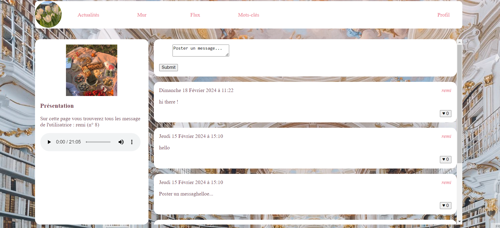

# Social Network v.1 
Group Project - 2 weeks
This social network is a platform that allows where users to register and login. They can explore the differents pages, like posts and follow users but they can also post messages.

## Tech Stack
- Client : HTML & CSS.
- Server : PHP, MySQL && MariaDB (PHPmyAdmin)

## Project Timeline 
- 05/02/2024 LARAGON Configuration and understanding PHP language with MySQL request. 
- 06/02/2024 Refactoring code in Mob Programming Session, use the SQL request to get the values from the table "post", "tags" and "likes". 
- 07/02/2024 Code reviews, added the link activation on tags and author's name. Put into function the registration and login form. 
- 08/02/2024 Use of SESSION superglobal to stay logged in, creation of a log out Form. Started working on the follower form.
- 12/02/2024 SQL request "POST" and "GET" to follow a user and see his informations. Working on the CSS. 
- 13/02/2024 Started working on the post messages : understanding the SQL request 'INSERT INTO '.Finished the post message function, started working on the likes function.
- 14/02/2024 Finished the likes function with the option of "unlike" a post. 
- 15/02/2024 Final day fixing small issues such as the tags link. Presentation of the Project. Retrospection with my collaborators. 

## Project Status
A steady progress in terms of functions, corrections of bugs and use of the database. 
Some functions can be added such as the 'unfollow button' and the option of a tag when a user writes a message. 

## Authors 
<a href='https://github.com/harfore'>Remi</a>, <a href='https://github.com/PDeslousPaoli'>Philippe</a> and <a href='https://github.com/zoeleca'>Zoe</a>. 
Students in Ada Tech School, PARIS. 
